El proyecto consta de actualizar un sistema de inventarios generado en .Net implementar las pantallas y actualizar componentes que requerian solucion.

Anterior Login

Actualizacion

Sidebar actual:

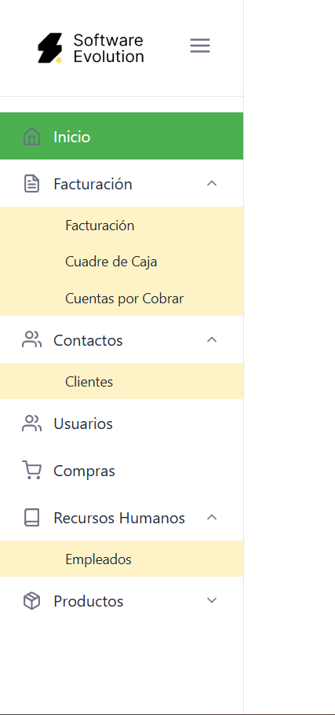

Diseño en proceso:

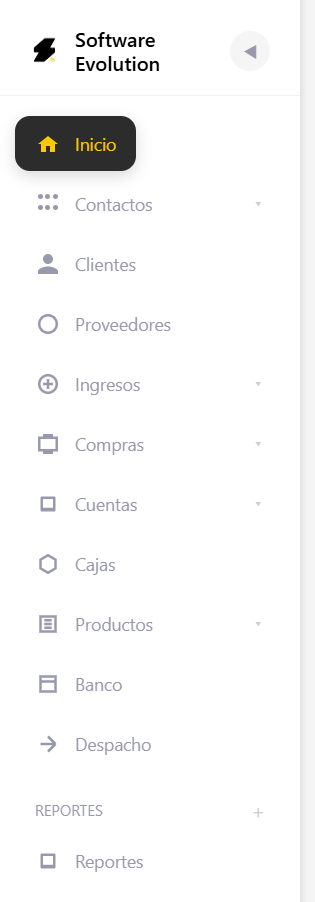

Facturacion Anterior:

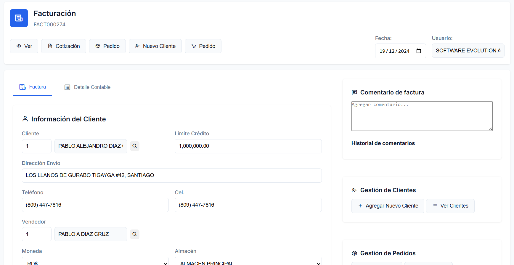

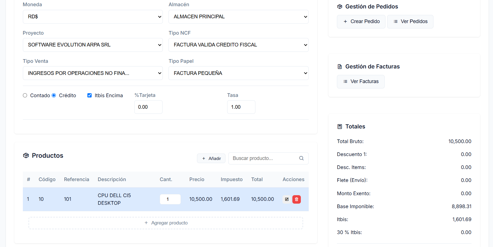

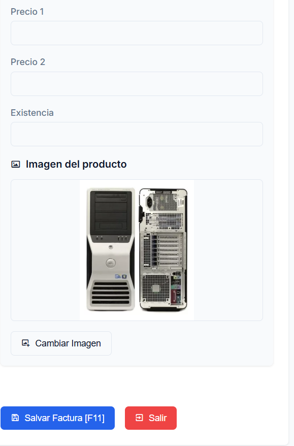

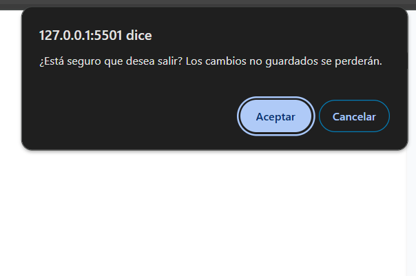

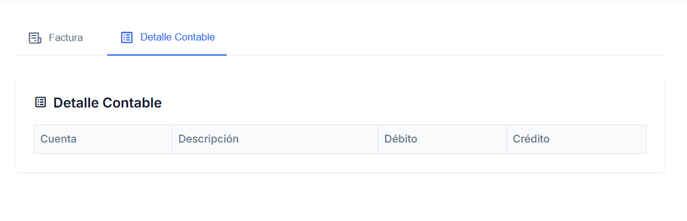

Facturacion Actual:

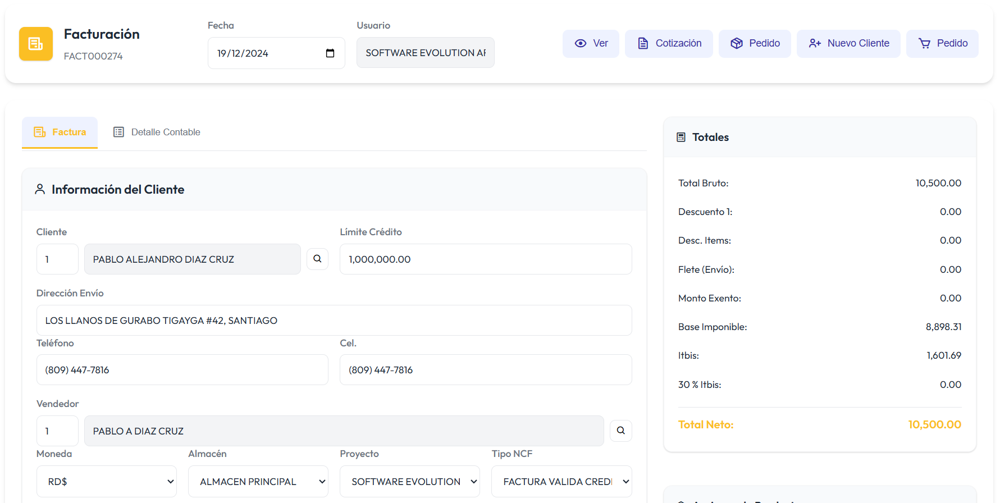

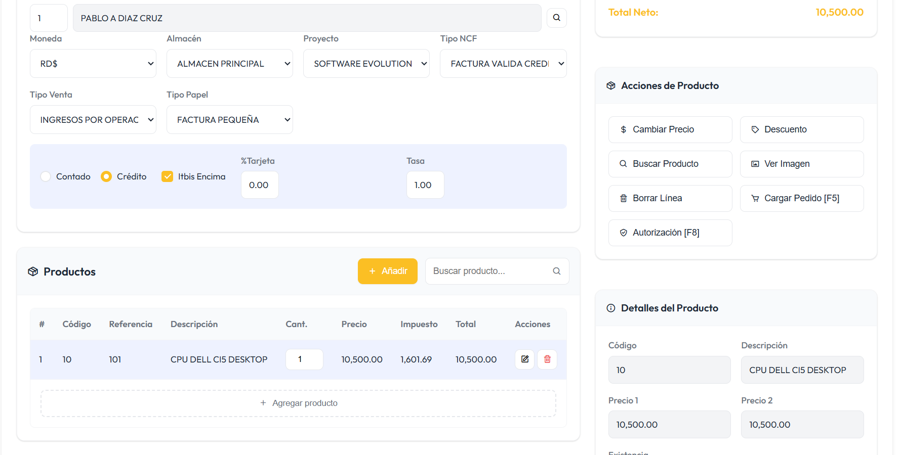

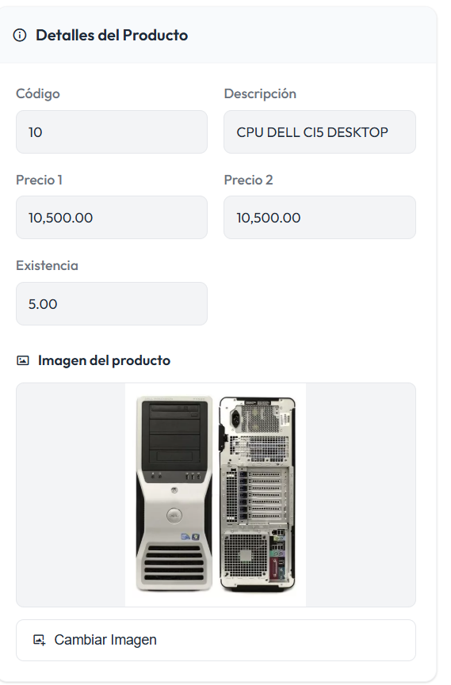

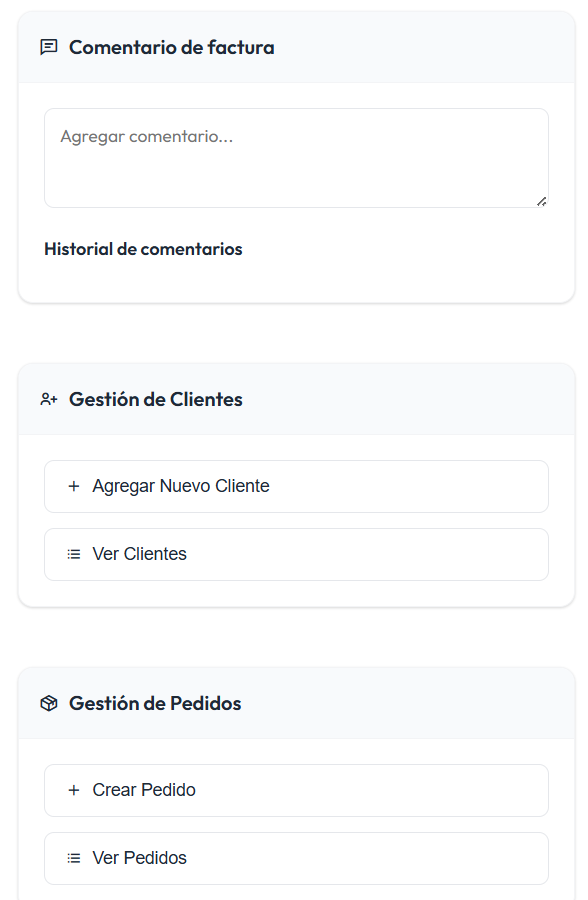

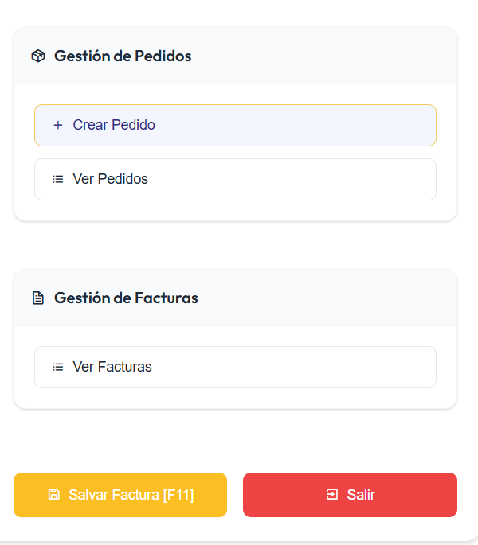

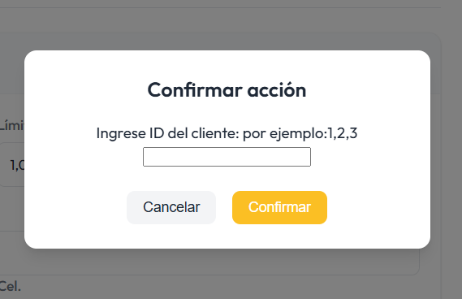

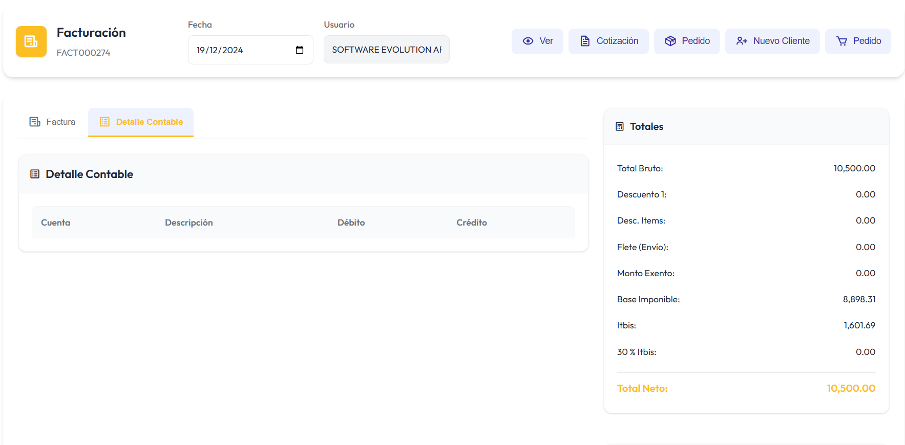

Se realizo una optimizacion en la velocidad de carga y manejo de eventos, se realizaron cambios en el responsive, se ingresaron actualizaciones dinamicas por lo que se obtuvo un diseño modal visualmente mas atractivo, se jugo con la paleta de colores y se ingresaron manejo de alerts dinamicos con cards todo manejado mediante el backend en javascript para asi mejorar la carga de las animaciones